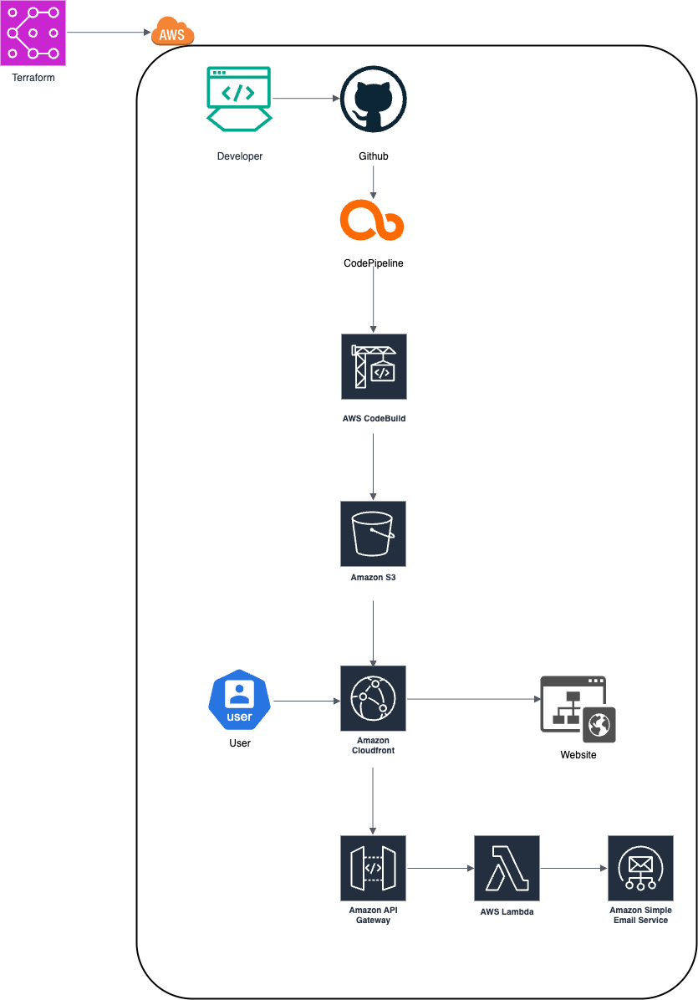

# 🐶 DevPuppy - AWS-Powered Portfolio Website

**DevPuppy** is a modern personal portfolio website built with AWS cloud infrastructure.  
A scalable web application featuring complete DevOps pipeline and Infrastructure as Code (IaC) implementation.

🌐 **Live Demo**: [https://tinyurl.com/devpuppy](https://tinyurl.com/devpuppy)

---

## 🏗️ System Architecture



The architecture demonstrates a complete serverless solution with:
- **Terraform** for Infrastructure as Code management
- **GitHub** integration with automated CI/CD pipeline
- **AWS CodePipeline & CodeBuild** for continuous deployment
- **S3 + CloudFront** for static website hosting
- **API Gateway + Lambda + SES** for contact form functionality

---

## 🚀 Key Features

### 🎨 Modern UI/UX
- **Responsive Design**: Optimized user experience across all devices
- **Dark/Light Mode**: Theme switching based on user preference
- **Smooth Animations**: Interactive elements powered by Framer Motion

### ⚡ Creative DevOps Visualization
- **Code-to-Music Animation**: Unique visual effect transforming DevOps commands into musical notes
- **AWS Characters**: Cute AWS service characters representing the tech stack
- **Real-time Typing Effects**: Terminal command execution simulation

### 📧 Smart Contact System
- **Serverless Backend**: Contact form powered by AWS Lambda + API Gateway
- **Automated Email Delivery**: Reliable mail sending through AWS SES
- **Real-time Status Feedback**: Instant confirmation of send success/failure

### 🔄 Fully Automated CI/CD
- **Branch-based Environment Separation**: Complete dev/prod environment isolation
- **Zero-downtime Deployment**: Instant updates via CloudFront cache invalidation
- **Infrastructure Version Control**: Infrastructure state management through Terraform

---

## 🛠️ Tech Stack

### Frontend
- **Framework**: Next.js 15.3.5 (App Router)
- **Language**: TypeScript
- **Styling**: Tailwind CSS 4.0
- **Animation**: Framer Motion
- **Icons**: React Icons
- **Build**: Static Site Generation (SSG)

### Backend & Infrastructure
- **Cloud Provider**: AWS
- **Hosting**: S3 + CloudFront
- **API**: API Gateway + Lambda (Node.js)
- **Email**: Amazon SES
- **CI/CD**: CodePipeline + CodeBuild
- **IaC**: Terraform
- **State Management**: Terraform Cloud

### DevOps & Monitoring
- **Version Control**: Git + GitHub
- **Environment**: dev/prod separation
- **Deployment**: Automated zero-downtime deployment
- **Caching**: CloudFront global CDN
- **Security**: IAM role-based access control

---

## 📁 Project Structure

```
devpuppy/
├── app/                           # Next.js Application
│   ├── src/
│   │   ├── app/                  # App Router Pages
│   │   │   ├── page.tsx         # Homepage
│   │   │   ├── projects/        # Projects Showcase
│   │   │   ├── contact/         # Contact Form
│   │   │   └── info/            # Personal Information
│   │   └── components/          # Reusable Components
│   │       ├── AWSCharacters.tsx    # AWS Character Animation
│   │       ├── CodeToMusic.tsx      # Code-to-Music Effect
│   │       ├── ThemeToggle.tsx      # Dark Mode Toggle
│   │       └── Sidebar.tsx          # Navigation
│   ├── public/                   # Static Assets
│   └── package.json             # Dependencies
├── infra/terraform/              # Infrastructure Code
│   ├── modules/                 # Reusable Modules
│   │   ├── static-site/        # S3 + CloudFront
│   │   ├── cicd/               # CodePipeline + CodeBuild
│   │   └── api/                # API Gateway + Lambda
│   ├── main.tf                 # Main Configuration
│   ├── variables.tf            # Variable Definitions
│   └── outputs.tf              # Output Values
├── buildspec.yml               # CodeBuild Configuration
├── devpuppy.drawio.png         # Architecture Diagram
├── docs/                       # Documentation
└── README.md                   # Project Documentation
```

---

## 🚀 Getting Started

### Prerequisites
- Node.js 18+ 
- AWS CLI configured
- Terraform installed
- GitHub account

### Local Development Setup

```bash
# Clone the repository
git clone https://github.com/KingZuto/devpuppy.git
cd devpuppy

# Install dependencies
cd app
npm install

# Start development server
npm run dev
```

Visit [http://localhost:3000](http://localhost:3000) to see the result.

### Infrastructure Deployment

```bash
# Initialize Terraform
cd infra/terraform
terraform init

# Review infrastructure plan
terraform plan

# Deploy infrastructure
terraform apply
```

---

## 🌍 Deployment Environments

### Development Environment
- **Branch**: `dev`
- **Auto Deploy**: ✅ Automatic deployment on dev branch push
- **Purpose**: Testing new features and bug fixes

### Production Environment
- **URL**: [https://tinyurl.com/devpuppy](https://tinyurl.com/devpuppy)
- **Branch**: `main`
- **Auto Deploy**: ✅ Automatic deployment on main branch push
- **Purpose**: Live production website

---

## 🎯 Key Highlights

### 1. Complete Serverless Architecture
- **Cost Efficiency**: Pay-per-use pricing minimizes operational costs
- **Scalability**: Automatic scaling based on traffic demand
- **Maintenance-Free**: No server management required
- **High Availability**: Built-in redundancy across AWS regions

### 2. Infrastructure as Code (IaC)
- **Version Control**: Track infrastructure changes with Git
- **Reproducibility**: Recreate identical environments anytime
- **Collaboration**: Easy infrastructure sharing among team members
- **Rollback Capability**: Quick rollback to previous infrastructure states

### 3. Environment Separation Strategy
- **Dev/Prod Isolation**: Completely independent AWS resources
- **Safe Deployment**: Thorough testing in dev before prod release
- **Resource Isolation**: Independent operation without cross-environment impact
- **Cost Management**: Separate billing and resource monitoring

### 4. Security Best Practices
- **IAM Roles**: Principle of least privilege applied
- **HTTPS Enforcement**: All communications encrypted
- **CORS Configuration**: API access control
- **Environment Variables**: Secure configuration management

---

## 📊 Performance Optimization

- **CDN Utilization**: Fast global content delivery via CloudFront
- **Static Site Generation**: Build-time optimization with Next.js SSG
- **Image Optimization**: Built-in Next.js image optimization features
- **Code Splitting**: Page-based bundle separation for faster initial loading
- **Caching Strategy**: Optimized cache headers for static assets

---

## 🔧 Development Workflow

### Code Quality
- **TypeScript**: Type safety and better developer experience
- **ESLint**: Code style consistency and error prevention
- **Prettier**: Automatic code formatting

### CI/CD Pipeline
1. **Code Push**: Developer pushes code to GitHub
2. **Pipeline Trigger**: CodePipeline automatically triggered
3. **Build Process**: CodeBuild compiles and tests the application
4. **Deployment**: Automated deployment to S3 and CloudFront invalidation
5. **Notification**: Status updates throughout the process

---

## 📈 Monitoring & Analytics

- **CloudWatch**: Infrastructure monitoring and logging
- **CloudFront Analytics**: Traffic and performance metrics
- **Cost Monitoring**: AWS Cost Explorer integration
- **Error Tracking**: Automated error detection and alerting

---

## 🤝 Contributing

1. Fork the Project
2. Create your Feature Branch (`git checkout -b feature/AmazingFeature`)
3. Commit your Changes (`git commit -m 'Add some AmazingFeature'`)
4. Push to the Branch (`git push origin feature/AmazingFeature`)
5. Open a Pull Request

---

## 📝 License

This project is distributed under the MIT License. See `LICENSE` file for more information.

---

## 📞 Contact

**Project Link**: [https://github.com/KingZuto/devpuppy](https://github.com/KingZuto/devpuppy)  
**Live Website**: [https://tinyurl.com/devpuppy](https://tinyurl.com/devpuppy)

---

## 🙏 Acknowledgments

This project was made possible with the help of these amazing technologies:

- [Next.js](https://nextjs.org/) - The React Framework for Production
- [AWS](https://aws.amazon.com/) - Cloud Computing Services
- [Terraform](https://www.terraform.io/) - Infrastructure as Code
- [Tailwind CSS](https://tailwindcss.com/) - Utility-First CSS Framework
- [Framer Motion](https://www.framer.com/motion/) - Production-Ready Motion Library
- [TypeScript](https://www.typescriptlang.org/) - JavaScript with Type Safety

---

*"Building the future, one commit at a time 🐶"*
