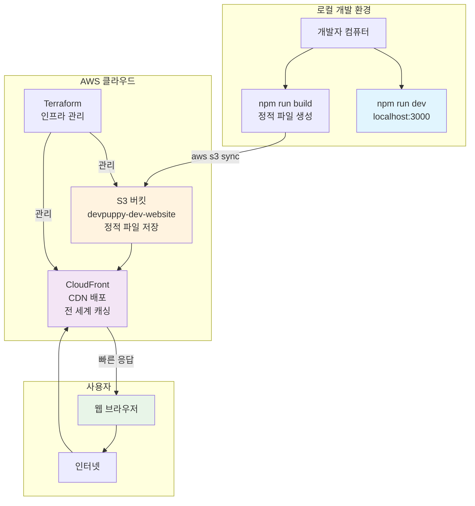
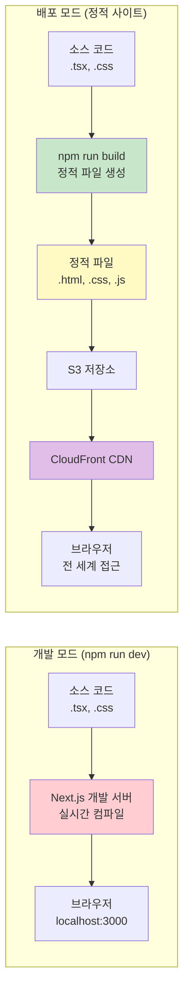
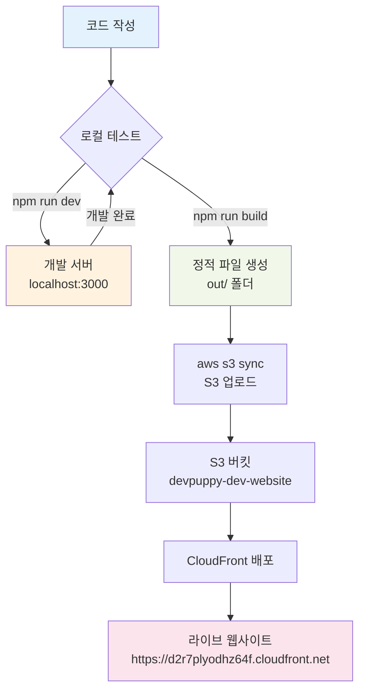
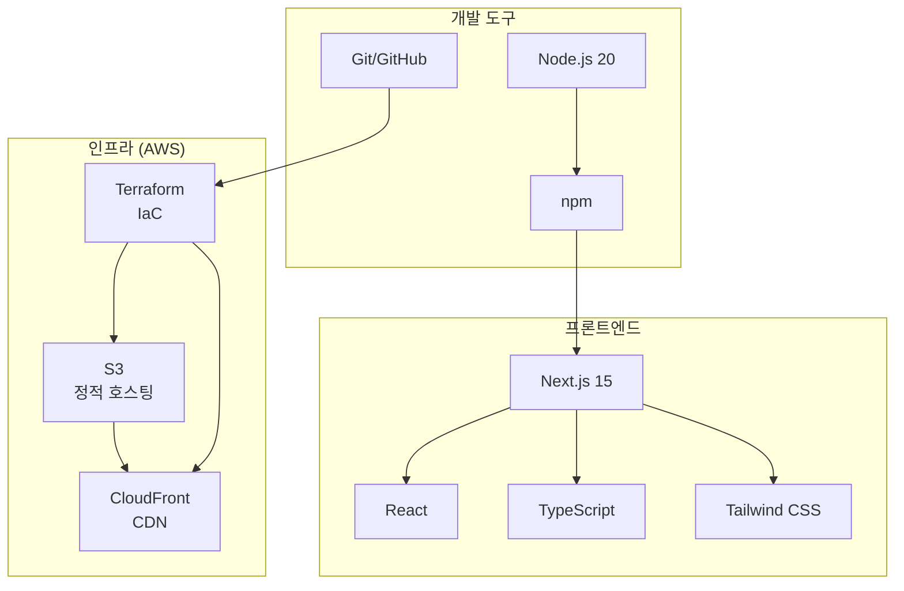
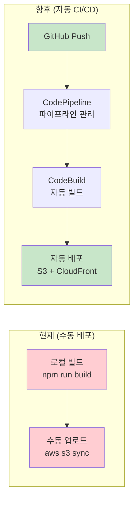

# DevPuppy 아키텍처 다이어그램

## 1. 전체 시스템 아키텍처

## 2. 개발 vs 배포 비교

## 3. 파일 흐름 다이어그램

## 4. 기술 스택

## 5. 향후 CI/CD 계획

---

## 요약

**현재 상태**: 정적 사이트 생성 → S3 저장 → CloudFront 배포 ✅  
**다음 단계**: GitHub 연동 자동 CI/CD 파이프라인 구축 🚀  
**최종 목표**: 코드 푸시 → 자동 빌드 → 자동 배포 🎯
